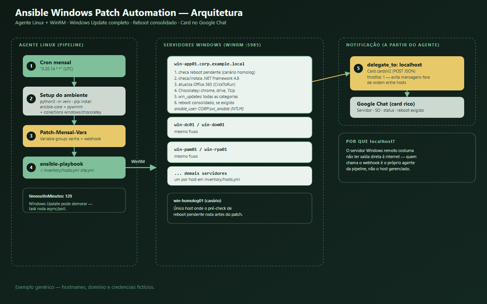
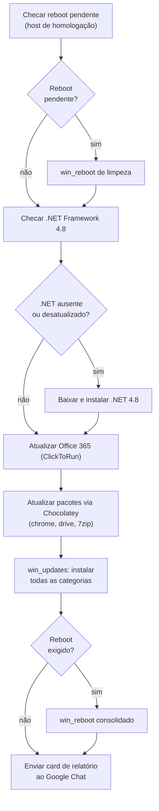

# Ansible Windows Patch Automation


Automação de **patch mensal de segurança (Windows Update)** para servidores Windows, usando **Azure Pipelines** (rodando em um agente Linux self-hosted) para agendamento/execução, **Ansible + WinRM** para orquestração remota, e notificação em formato de card rico no Google Chat.

> Este repositório documenta o **padrão de arquitetura**, não uma implementação de produção específica. Todos os hostnames, domínios e credenciais abaixo são **exemplos fictícios** — substitua pelos valores reais do seu ambiente.

> ℹ️ O exemplo usa **Azure Pipelines** como orquestrador de CI/CD, mas o padrão é independente de ferramenta — a mesma lógica (agendamento via cron, inventário Ansible, playbook via WinRM, notificação) se aplica igualmente a **GitHub Actions, GitLab CI, Jenkins** ou qualquer outro orquestrador com suporte a agendamento e a um agente (Linux ou Windows) com rede até os servidores gerenciados.



## Índice

- [Por que isso existe](#por-que-isso-existe)
- [Diferencial: gerenciar Windows a partir de um agente Linux](#diferencial-gerenciar-windows-a-partir-de-um-agente-linux)
- [Estrutura do repositório](#estrutura-do-repositório)
- [Setup passo a passo (do zero)](#setup-passo-a-passo-do-zero)
- [1. Inventário](#1-inventário)
- [2. Pipeline](#2-pipeline)
- [3. Playbook (site.yml)](#3-playbook-siteyml)
- [4. Notificação (Google Chat card)](#4-notificação-google-chat-card)
- [Fluxo de execução completo](#fluxo-de-execução-completo)
- [Como adaptar para o seu ambiente](#como-adaptar-para-o-seu-ambiente)
- [Boas práticas de segurança](#boas-práticas-de-segurança)

## Por que isso existe

Aplicar Windows Update manualmente em dezenas de servidores todo mês — via RDP, um por um — não escala e é fácil de esquecer um host. Este padrão automatiza:

- **Windows Update completo** (todas as categorias) via módulo nativo do Ansible, sem precisar de WSUS/SCCM.
- **Pré-requisitos comuns** verificados e corrigidos automaticamente (.NET Framework, reboot pendente).
- **Atualização de software de terceiros** (navegador, utilitários) via Chocolatey.
- **Reboot consolidado**: um único reboot ao final, só se o Windows Update exigir — evita reboots desnecessários no meio do processo.
- **Relatório visual por servidor**, em formato de card, no Google Chat.

## Diferencial: gerenciar Windows a partir de um agente Linux

O agente da pipeline é **Linux** — o Ansible controla os servidores Windows remotamente via **WinRM** (porta 5985), não via SSH. Isso significa que o agente de execução não precisa ser Windows; só precisa ter Python, o `ansible-core` e as coleções corretas instaladas. A pipeline monta esse ambiente do zero a cada execução, em um virtualenv Python:

```bash
python3 -m venv ansible_env
source ansible_env/bin/activate
pip install --upgrade pip
pip install ansible-core pywinrm

ansible-galaxy collection install ansible.windows
ansible-galaxy collection install chocolatey.chocolatey
```

`pywinrm` é a dependência que permite ao Ansible falar WinRM; as coleções `ansible.windows` e `chocolatey.chocolatey` trazem os módulos (`win_updates`, `win_reboot`, `win_chocolatey`, etc.) usados no playbook.

## Estrutura do repositório

```
.
├── inventory/
│   ├── hosts.yml               # lista de servidores Windows por ambiente
│   └── group_vars/
│       └── windows.yml         # credenciais/transporte WinRM do grupo "windows"
├── site.yml                    # playbook: pré-checks, patch, reboot, notificação
└── azure-pipelines.yml         # agendamento + setup do ambiente Ansible + execução
```

---

## Setup passo a passo (do zero)

Tudo o que precisa existir **fora do código**. Os exemplos usam nomes fictícios — substitua pelos do seu ambiente.

### Passo 1 — Criar a conta de serviço de domínio

Use uma conta dedicada (ex.: `CORP\svc_ansible`), nunca a conta pessoal de um administrador: facilita auditoria e
permite girar a senha sem depender de uma pessoa. Ela precisa de **direito de administração remota** em cada
servidor do inventário — normalmente via associação ao grupo local `Administradores` ou `Remote Management Users`.

### Passo 2 — Habilitar o WinRM em cada servidor Windows

No PowerShell **como administrador**, em cada host alvo:

```powershell
# habilita o WinRM e cria o listener HTTP padrão (porta 5985)
Enable-PSRemoting -Force

# confirma que o listener existe
winrm enumerate winrm/config/listener

# confirma a regra de firewall de entrada
Get-NetFirewallRule -Name "WINRM-HTTP-In-TCP" | Select-Object Enabled, Profile
```

O agente do CI/CD precisa alcançar a **porta 5985/TCP** desses hosts — valide também regras de firewall de rede
entre a sub-rede do agente e a dos servidores.

> Para ambientes que exigem tráfego criptografado, use o listener HTTPS na porta 5986 com certificado válido e
> ajuste `ansible_port` e `ansible_winrm_server_cert_validation` no `group_vars`.

### Passo 3 — Cadastrar os segredos no orquestrador

No Azure DevOps: `Pipelines → Library → + Variable group`, criando um grupo (ex.: `Patch-Mensal-Vars`) com as duas
variáveis abaixo, ambas marcadas como **secretas** (ícone de cadeado):

| Variável | Conteúdo |
|---|---|
| `WINRM_PASSWORD` | Senha da conta de serviço do passo 1 |
| `GOOGLE_CHAT_WEBHOOK` | URL completa do webhook do canal de chat |

Em **Pipeline permissions**, autorize a pipeline a usar o grupo. O nome do grupo precisa bater com o YAML:

```yaml
variables:
- group: Patch-Mensal-Vars   # <-- mesmo nome criado na Library
```

Marcar como secreta é o que faz o orquestrador **mascarar os valores nos logs**.

### Passo 4 — Criar o webhook de notificação

No Google Chat: `Gerenciar webhooks → Adicionar webhook`, copie a URL e cole no valor da variável secreta
`GOOGLE_CHAT_WEBHOOK` do passo anterior. A URL nunca é versionada no repositório.

### Passo 5 — Preparar o agente de execução (Linux)

O agente precisa de:

- **`python3` com o módulo `venv`** (pacote `python3-venv` no Debian/Ubuntu);
- **acesso de saída** ao PyPI (`pip install`) e ao Ansible Galaxy (`ansible-galaxy collection install`);
- **rota de rede** até a porta 5985 dos servidores Windows.

Não é preciso pré-instalar o Ansible — a própria pipeline monta o ambiente a cada execução (ver
[Diferencial](#diferencial-gerenciar-windows-a-partir-de-um-agente-linux)).

### Passo 6 — Popular o inventário

Edite `inventory/hosts.yml` adicionando cada servidor sob `windows: hosts:`:

```yaml
all:
  children:
    windows:
      hosts:
        winsrv-homolog01:
          ansible_host: winsrv-homolog01.corp.example.local
        win-app01:
          ansible_host: win-app01.corp.example.local
```

E confira as variáveis de conexão em `inventory/group_vars/windows.yml` — principalmente o domínio da conta:

```yaml
ansible_user: "CORP\\svc_ansible"   # a barra dupla é o escape de uma barra invertida literal no YAML
```

### Passo 7 — Validar os pré-requisitos internos dos servidores

O playbook já resolve dois deles automaticamente, mas vale saber que existem:

- **.NET Framework 4.8** — exigido pelo Chocolatey 2.0+. O playbook detecta (release key ≥ 528040) e instala
  silenciosamente se faltar.
- **Reboot pendente** — no exemplo, só é verificado e resolvido no host "canário" de homologação; nos demais, um
  reboot pendente antigo pode travar o Windows Update. Vale generalizar essa checagem se o problema for recorrente
  na sua frota.

### Passo 8 — Primeira execução controlada

Rode primeiro contra um único host de homologação, usando `--limit` num teste manual ou reduzindo temporariamente
o inventário. Valide que: a autenticação WinRM funcionou, o Windows Update rodou, e o card chegou no canal. Só
então libere para produção.

### Checklist final

| Item | Onde vive |
|---|---|
| Conta de serviço com admin remoto | Active Directory |
| WinRM habilitado (5985) | Cada servidor Windows |
| `WINRM_PASSWORD` e `GOOGLE_CHAT_WEBHOOK` | Variable group secreto do CI/CD (nunca no Git) |
| Agente Linux com acesso a PyPI/Galaxy e porta 5985 | Pool de agentes self-hosted |
| Lista de servidores e variáveis de conexão | `inventory/` (versionado, sem senha) |

## 1. Inventário

`inventory/hosts.yml` — um grupo `windows` com hosts de homologação e produção, endereçados por FQDN interno:

```yaml
all:
  children:
    windows:
      hosts:
        # Homologação
        winsrv-homolog01:
          ansible_host: winsrv-homolog01.corp.example.local

        # Produção
        win-dc01:
          ansible_host: win-dc01.corp.example.local
        win-app01:
          ansible_host: win-app01.corp.example.local
        win-dom01:
          ansible_host: win-dom01.corp.example.local
        win-pam01:
          ansible_host: win-pam01.corp.example.local
        win-rpa01:
          ansible_host: win-rpa01.corp.example.local
```

`inventory/group_vars/windows.yml` — credencial e transporte aplicados a todo o grupo `windows`:

```yaml
ansible_user: "CORP\\svc_ansible"
ansible_connection: winrm
ansible_port: 5985
ansible_winrm_transport: ntlm
ansible_winrm_server_cert_validation: ignore
```

> A senha **não fica aqui** — ela é injetada em runtime pela pipeline (`-e "ansible_password=..."`), vinda de um cofre de segredos. Ver [Boas práticas de segurança](#boas-práticas-de-segurança).

---

## 2. Pipeline

```yaml
trigger: none  # evita disparo acidental por commit na main

schedules:
  - cron: "0 20 14 * *"   # dia 14, 20:00 UTC — sempre confira o fuso do seu ambiente
    displayName: "Execução Mensal de Patches"
    branches:
      include: [main]
    always: true

variables:
  - group: Patch-Mensal-Vars   # variable group secreto: mapeia $(WINRM_PASSWORD) e $(GOOGLE_CHAT_WEBHOOK)

jobs:
  - job: PatchManagement
    timeoutInMinutes: 120   # Windows Update em várias máquinas pode demorar
    pool:
      name: "self-hosted-linux-pool"

    steps:
      - script: |
          python3 -m venv ansible_env
          source ansible_env/bin/activate
          pip install --upgrade pip
          pip install ansible-core pywinrm
        displayName: "Setup: Python venv + Ansible core"

      - script: |
          source ansible_env/bin/activate
          ansible-galaxy collection install ansible.windows
          ansible-galaxy collection install chocolatey.chocolatey
        displayName: "Setup: coleções Windows/Chocolatey"

      - script: |
          source ansible_env/bin/activate
          ansible-playbook -i inventory/hosts.yml site.yml \
            -e "ansible_password=$WINRM_PASSWORD" \
            -e "google_chat_webhook=$GOOGLE_CHAT_WEBHOOK"
        displayName: "Executar patch (Ansible)"
        env:
          ANSIBLE_HOST_KEY_CHECKING: "False"
          WINRM_PASSWORD: $(WINRM_PASSWORD)
          GOOGLE_CHAT_WEBHOOK: $(GOOGLE_CHAT_WEBHOOK)
```

**Pontos-chave:**

- `variables: - group: Patch-Mensal-Vars` → senha do WinRM e URL do webhook vêm de um **variable group secreto** do Azure DevOps, nunca do código-fonte. É o padrão certo para lidar com esses dois segredos.
- O ambiente Ansible (venv + coleções) é montado **do zero a cada execução** — mais lento, mas garante que o agente não precisa de nenhuma instalação prévia além de Python.
- `timeoutInMinutes: 120` e, dentro do playbook, `async/poll` na task de update (seção 3) — Windows Update pode legitimamente demorar mais que o timeout padrão de uma task comum.

---

## 3. Playbook (site.yml)



Tasks, em ordem:

1. **Checar reboot pendente** (`win_shell` lendo chaves de registro conhecidas de reboot pendente) — executado apenas em um host de homologação específico, usado como "canário" para destravar atualizações presas antes do patch real.
2. **Reboot de limpeza condicional** (`ansible.windows.win_reboot`) — só roda se o passo anterior detectou pendência.
3. **Checar .NET Framework 4.8** via release key do registro — pré-requisito do Chocolatey 2.0+.
4. **Instalar .NET 4.8 silenciosamente**, se necessário, baixando o instalador oficial da Microsoft.
5. **Atualizar Office 365 (ClickToRun)**, se instalado no servidor.
6. **Atualizar pacotes de terceiros via Chocolatey** (`win_chocolatey`, `state: latest`), com `ignore_errors: yes` — uma falha em um pacote não interrompe o restante.
7. **Aplicar Windows Update** (`ansible.windows.win_updates`, `category_names: '*'`, `reboot: no`) — busca e instala **todas** as categorias de update, mas não reinicia sozinho; roda em modo assíncrono (`async: 7200`, `poll: 60`) para não derrubar a conexão WinRM em updates longos.
8. **Reboot consolidado**, só se `update_result.reboot_required` for verdadeiro — um único reboot ao final, não um por update.
9. **Enviar relatório** ao Google Chat.

---

## 4. Notificação (Google Chat card)

Diferente do relatório em texto simples de outras esteiras, este usa o formato **cardsV2** da API do Google Chat, com título, subtítulo e corpo formatado em HTML básico:

```yaml
- name: Enviar Relatório de Patching (Google Chat)
  ansible.builtin.uri:
    url: "{{ google_chat_webhook }}"
    method: POST
    body_format: json
    body:
      cardsV2:
        - cardId: "patchReportCard"
          card:
            header:
              title: "🛡️ Relatório de Patch Management"
              subtitle: "Execução Automática de Patching"
            sections:
              - widgets:
                  - textParagraph:
                      text: >-
                        💻 <b>Servidor:</b> {{ ansible_hostname }}<br>
                        🪟 <b>SO:</b> {{ ansible_os_name }}<br>
                        📢 <b>Status:</b> SUCESSONENHUMA ATUALIZAÇÃO<br>
                        📦 <b>Pendentes:</b> {{ update_result.updates | length }}<br>
                        ✅ <b>Aplicados:</b> {{ update_result.installed_update_count | default(0) }}<br>
                        🔁 <b>Reboot exigido?</b> SIMNÃO
  delegate_to: localhost
  throttle: 1
```

`delegate_to: localhost` é essencial aqui: a chamada HTTP ao webhook deve sair do **agente da pipeline**, não do servidor Windows remoto (que normalmente não tem saída direta à internet). `throttle: 1` serializa o envio das mensagens, evitando notificações fora de ordem quando vários hosts terminam ao mesmo tempo.

---

## Fluxo de execução completo

1. O cron da pipeline dispara (ou alguém roda manualmente).
2. O agente Linux monta um ambiente Python + Ansible do zero (venv, `ansible-core`, coleções Windows/Chocolatey).
3. O Ansible conecta em cada host Windows via WinRM, usando a senha vinda do variable group.
4. Em cada host: valida/corrige reboot pendente e .NET → atualiza Office e pacotes Chocolatey → aplica Windows Update completo → reinicia uma única vez, se necessário.
5. Ao final de cada host, um card de relatório é enviado ao Google Chat a partir do agente da pipeline.

## Como adaptar para o seu ambiente

- **Outro gerenciador de pacotes de terceiros?** Troque a lista do `win_chocolatey` pelos seus pacotes, ou substitua por `winget` via `win_shell` se preferir não depender do Chocolatey.
- **WSUS/SCCM já existente?** `win_updates` pode ser configurado para respeitar um servidor WSUS em vez de ir direto ao Windows Update público, ajustando as políticas de update do host.
- **Sem host "canário" de homologação?** O passo de checar/forçar reboot de limpeza pode ser generalizado para rodar em todo o grupo, não só em um host fixo — útil se o problema de reboot pendente não for específico de uma máquina.
- **Outro canal de notificação?** Troque o `body` (formato `cardsV2`) por um payload simples (`{"text": "..."}`) se o destino for Slack/Teams em vez de Google Chat.

## Boas práticas de segurança

- **Segredos via variable group, nunca no código** — este repositório já segue esse padrão: senha do WinRM e URL do webhook vêm de `Patch-Mensal-Vars`, referenciado só pelo nome no YAML. É o modelo a copiar para qualquer novo segredo.
- **`ansible_winrm_server_cert_validation: ignore`** desabilita a validação do certificado TLS do WinRM — aceitável em uma rede interna controlada com certificados autoassinados, mas vale substituir por um certificado válido internamente quando possível, em vez de ignorar a validação.
- **Conta de serviço dedicada** (`svc_ansible` no exemplo) em vez de uma conta de usuário pessoal — limita o escopo de auditoria e permite girar a senha sem depender de uma pessoa.
- **Reboot consolidado ao final**, não por update individual — reduz o número de reinicializações e o tempo total de indisponibilidade de cada servidor.

---

*Este documento descreve um padrão de automação genérico, inspirado em um caso de uso real, mas com todos os dados específicos de ambiente substituídos por exemplos.*
